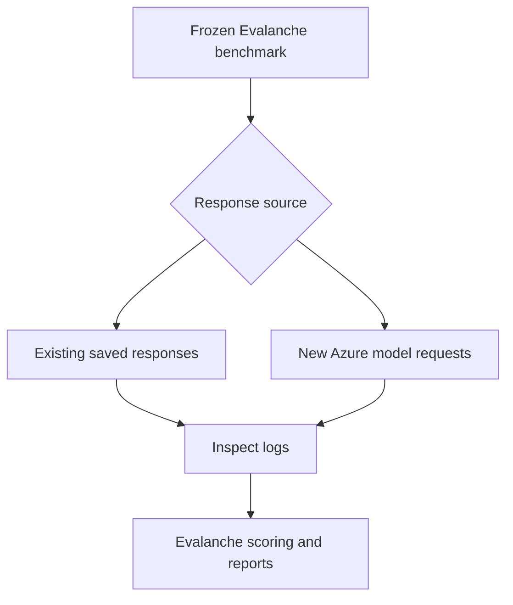

# Using Inspect AI with Evalanche

Evalanche has an optional Inspect AI integration for the frozen Health Canada
Drug Product Database (DPD) structured-extraction benchmark.

Evalanche still defines the evaluation. It owns the dataset, prompt, expected
answers, model settings, benchmark fingerprint, and deterministic scorer.
Inspect AI provides another way to execute the evaluation, save detailed logs,
inspect individual cases, and retry interrupted live runs.

The integration currently supports:

`hc_dpd_structured_extraction@0.2.0`

It does not yet provide a generic Inspect task for every Evalanche benchmark.

## How it works



The process is:

1. Evalanche loads the frozen DPD benchmark and verifies its fingerprint.
2. You choose where the model responses come from:
   - `replay` uses the 420 saved audit responses;
   - `import-results` uses all retained full-census responses;
   - `run` sends new requests to Azure.
3. Inspect stores the input, response, target, score, metadata, timing, and
   token information in `.eval` logs.
4. The Inspect task calls Evalanche's canonical deterministic JSON scorer.
5. Evalanche creates compact model, language, stratum, token, cost, timing,
   error, and parity reports from the Inspect logs.

Inspect does not create a different benchmark or a different answer key. It
provides execution and inspection infrastructure around the existing
Evalanche evaluation contract.

## Choose the correct command

| Goal | Command | Azure requests |
| --- | --- | ---: |
| Check the installation and benchmark | `doctor` | 0 |
| Compare the scorer with 420 published audit results | `parity` | 0 |
| Put those 420 saved audit responses into Inspect | `replay` | 0 |
| Put all 56,136 saved full-census responses into Inspect | `import-results` | 0 |
| Generate new model responses through Inspect | `run` | Yes |
| Retry an interrupted or failed live Inspect log | `retry` | Possibly |
| Rebuild summaries from existing Inspect logs | `report` | 0 |

If responses already exist, use `replay` or `import-results`. Use `run` only
when you intentionally want new model responses.

## First-time Docker setup

Run all commands from the Evalanche repository root.

If `.env` does not exist, create it on Windows Command Prompt:

```bat
copy .env.example .env
```

Do not overwrite an existing `.env` containing working credentials or model
routes.

Build the optional Inspect image:

```bat
docker compose --profile inspect build inspect
```

The image uses Python 3.11 and the versions pinned in
`requirements-inspect.txt`:

- `inspect-ai==0.3.257`
- `openai==2.54.0`

The repository is mounted into the container at `/app`. Normal source and
documentation changes appear immediately. Rebuild the image when the Dockerfile
or dependency files change.

## Validate the integration offline

These commands do not call Azure.

### 1. Check dependencies and the benchmark

```bat
docker compose --profile inspect run --rm inspect python -m integrations.inspect_ai.cli doctor
```

A healthy result has:

- `status: ready`
- the expected pinned Inspect and OpenAI versions;
- 24 demo cases, 105 audit cases, and 14,034 full cases;
- `scorer_parity: passed`.

`ready_for_paid_run` can be `false` when credentials are missing. That does not
prevent offline replay or historical import.

### 2. Check scorer parity directly

```bat
docker compose --profile inspect run --rm inspect python -m integrations.inspect_ai.cli parity
```

This re-scores 420 saved outputs from 105 audited cases across four models. A
healthy result has zero strict, field-score, and mismatched-field
disagreements.

### 3. Replay the audit responses inside Inspect

```bat
docker compose --profile inspect run --rm inspect python -m integrations.inspect_ai.cli replay --display plain
```

This proves that saved responses and the Evalanche scorer work inside an
actual Inspect task. It creates Inspect logs without contacting a provider.

## Import the complete historical results

Use this path when the complete historical response file exists:

```text
data/generated/hc_dpd_census_all_models_outputs.csv
```

The published DPD release identifies that file as:

- 178,682,096 bytes;
- SHA-256
  `040a92bb4eb45e6353fae728d108459584fd1ac44566bda04038a2736d8e9887`;
- 14,034 cases for each of four models;
- 56,136 saved responses in total.

Check that the file exists:

```bat
dir data\generated\hc_dpd_census_all_models_outputs.csv
```

### 1. Validate the file and create a plan

```bat
docker compose --profile inspect run --rm inspect python -m integrations.inspect_ai.cli import-results --campaign dpd-historical-full-20260729 --plan-only
```

Planning makes zero provider requests. Before accepting the source, Evalanche
checks:

- the exact published byte size and SHA-256;
- all 56,136 unique model and case combinations;
- successful generation status and non-empty output for every row;
- complete case membership for every model;
- exact inputs, targets, languages, and strata from the frozen census;
- the published run metadata and case-score artifact hashes.

### 2. Test a small import

Use a separate campaign name for the small test:

```bat
docker compose --profile inspect run --rm inspect python -m integrations.inspect_ai.cli import-results --campaign dpd-historical-check-20260813 --limit 2
```

This imports two saved responses per model, eight responses total. A successful
test reports:

- `status: passed`;
- `provider_requests: 0`;
- eight imported and expected saved outputs;
- eight parity checks;
- zero parity disagreements.

### 3. Import all historical responses

```bat
docker compose --profile inspect run --rm inspect python -m integrations.inspect_ai.cli import-results --campaign dpd-historical-full-20260729
```

The import does not need Azure credentials and does not generate new answers.
For every case, it:

1. takes the saved `model_output` from the historical CSV;
2. records it as the completion in an Inspect sample;
3. scores it with the canonical Evalanche scorer;
4. compares the new score with the published case score;
5. fails the import if any parity check disagrees.

A successful complete import has 56,136 samples and 56,136 passing parity
checks.

### Why imported logs show `mockllm/model`

Inspect expects each task to have a model. Historical import does not call a
model, so the task uses Inspect's local `mockllm/model` placeholder. The
original model ID, historical run ID, saved response, and source hash are
stored in the task and sample metadata.

The historical models are:

- `gpt_5_4_mini`
- `gpt_5_6_luna`
- `gpt_5_6_terra`
- `gpt_5_6_sol`

Seeing `mockllm/model` therefore does not mean the historical responses came
from a mock model.

## Generate new responses through Inspect

This path calls Azure and can incur cost. Use it only when new responses are
required.

### Configure Azure

The Inspect wrapper accepts the existing Evalanche environment variables and
maps them to the names Inspect expects in memory:

```dotenv
AZURE_API_KEY=...
AZURE_API_BASE=https://YOUR-RESOURCE.cognitiveservices.azure.com/
AZURE_API_VERSION=...

CANDIDATE_MODEL=azure/YOUR-MINI-DEPLOYMENT
GPT_5_6_LUNA_MODEL=azure/YOUR-LUNA-DEPLOYMENT
GPT_5_6_TERRA_MODEL=azure/YOUR-TERRA-DEPLOYMENT
GPT_5_6_SOL_MODEL=azure/YOUR-SOL-DEPLOYMENT
```

The diagnostic output reports whether credentials are present. It does not
print their values.

Confirm that paid execution is ready:

```bat
docker compose --profile inspect run --rm inspect python -m integrations.inspect_ai.cli doctor --require-credentials
```

### Start with one 24-case demo

```bat
docker compose --profile inspect run --rm inspect python -m integrations.inspect_ai.cli run --scope demo --model gpt_5_6_sol --campaign dpd-inspect-sol-demo-20260813
```

This sends 24 new requests to the configured Sol deployment.

### Available scopes

| Scope | Cases per model | Use |
| --- | ---: | --- |
| `demo` | 24 | Check transport, prompting, parsing, and scoring |
| `audit` | 105 | Compare the selected published audit cases |
| `full` | 14,034 | Run the complete bilingual census |

### Plan a larger run before paying for it

One complete model:

```bat
docker compose --profile inspect run --rm inspect python -m integrations.inspect_ai.cli run --scope full --model gpt_5_6_sol --campaign dpd-inspect-sol-full-20260813 --plan-only
```

All four registered models:

```bat
docker compose --profile inspect run --rm inspect python -m integrations.inspect_ai.cli run --scope full --all-models --campaign dpd-inspect-all-full-20260813 --plan-only
```

Planning does not contact Azure. A full four-model run means 56,136 initial
requests before retries. At the default rate of 60 request starts per minute,
one 14,034-case model has a minimum request window of about 234 minutes before
latency, backoff, and retries.

### Run a planned evaluation

Remove `--plan-only` and keep the same campaign name, provided that campaign
does not already contain `.eval` logs:

```bat
docker compose --profile inspect run --rm inspect python -m integrations.inspect_ai.cli run --scope full --model gpt_5_6_sol --campaign dpd-inspect-sol-full-20260813
```

Useful controls include:

- `--limit N`, run only the first N selected cases;
- `--requests-per-minute N`, override the manifest rate deliberately;
- `--max-connections N`, control concurrent requests;
- `--timeout N`, control the request timeout;
- `--retry-on-error N`, control whole-sample retries;
- `--display none`, suppress the progress display.

Models run sequentially. Each model uses the request settings in its Evalanche
manifest, including completion limit, reasoning effort, temperature, and
provider retry count.

## Retry an interrupted live run

Live runs enable Inspect checkpointing. Retry a specific interrupted or failed
log instead of repeating completed samples:

```bat
docker compose --profile inspect run --rm inspect python -m integrations.inspect_ai.cli retry --log-file results/inspect_ai/MY-CAMPAIGN/logs/FAILED.eval
```

The reporter merges retry logs by model and sample ID and keeps the newest
record.

`run` and `import-results` refuse to add fresh logs to a campaign that already
contains `.eval` files. This prevents accidental double counting. Use `retry`
for a failed live log, or choose a new campaign name when starting a separate
evaluation.

## Open the Inspect log viewer on Windows

The following command publishes the viewer only on the Windows host's loopback
address. Leave the terminal open while using the viewer:

```bat
docker compose --profile inspect run --rm -p 127.0.0.1:7576:7576 inspect inspect view start --log-dir results/inspect_ai/dpd-historical-full-20260729/logs --host 0.0.0.0 --port 7576 --trusted-origin http://127.0.0.1:7576 --trusted-host 127.0.0.1:7576 --unsafe-allow-unauthenticated
```

Then open:

<http://127.0.0.1:7576>

The container must listen on `0.0.0.0` so Docker can forward the port. Docker
publishes it as `127.0.0.1:7576`, so it remains local to the Windows machine.

In the viewer you can inspect:

- each evaluation log;
- individual cases;
- the rendered input messages;
- the expected answer;
- the model's saved or newly generated response;
- strict, field, and valid-JSON scores;
- mismatched fields and parity metadata;
- timing, token usage, model metadata, and errors.

Press `Ctrl+C` in the terminal to stop the viewer.

### View a different campaign

Replace the log directory in the command:

```text
results/inspect_ai/MY-CAMPAIGN/logs
```

### Port already allocated

See which Docker container is publishing the port:

```bat
docker ps --filter "publish=7576"
```

Or use port `7577`. Change every `7576` in the viewer command and URL to
`7577`.

### Invalid host header

Open the exact URL declared in `--trusted-origin`. For the command above, use:

```text
http://127.0.0.1:7576
```

Do not switch between `localhost` and `127.0.0.1` unless the command's trusted
origin and host values are changed to match.

## Output files

Historical import produces:

```text
results/inspect_ai/<campaign>/
  import_plan.json
  import_result.json
  logs/
    *.eval
  report/
    case_results.csv.gz
    summary.json
    summary.md
```

A live run uses `campaign_plan.json` instead of `import_plan.json` and does not
create `import_result.json`.

Open the human-readable summary on Windows:

```bat
notepad results\inspect_ai\dpd-historical-full-20260729\report\summary.md
```

The files mean:

| File | Purpose |
| --- | --- |
| `import_plan.json` | Source identity, models, counts, fingerprints, and zero-call declaration |
| `campaign_plan.json` | Planned live models, routes, settings, rates, and request count |
| `import_result.json` | Final historical import status and parity result |
| `logs/*.eval` | Inspect-native case, response, score, and metadata logs |
| `case_results.csv.gz` | Compact case-level results for analysis |
| `summary.json` | Machine-readable model, language, and stratum summaries |
| `summary.md` | Short human-readable result table |

Generated Inspect results are under `results/inspect_ai/` and are ignored by
Git. Commit the integration source and documentation, not local campaign logs.

## Read the metrics

- **Strict pass rate:** percentage of responses whose structured answer fully
  satisfies the deterministic comparison.
- **Mean field score:** average proportion of expected JSON fields that match.
- **Valid JSON rate:** percentage of responses parsed as valid JSON.
- **Sample errors:** transport, execution, or scoring errors recorded by
  Inspect.
- **Parity:** whether a re-scored saved response exactly matches its published
  strict result, JSON validity, field score, and mismatched-field list.
- **Language and stratum slices:** the same metrics grouped by English or
  French and by benchmark case type.
- **Tokens, cost, and timing:** live values or retained historical generation
  metadata when available.

Strict pass rate is not automatically a universal model recommendation. Review
field performance, language slices, reliability, latency, cost, and individual
failures together.

## Integration files

| File | Responsibility |
| --- | --- |
| `adapter.py` | Loads the frozen benchmark, validates saved artifacts, maps model routes, and calls the Evalanche scorer |
| `dpd_task.py` | Defines the Inspect tasks, saved-output solver, rate limiter, and custom scorer |
| `cli.py` | Implements `doctor`, `parity`, `replay`, `import-results`, `run`, `retry`, and `report` |
| `reporting.py` | Converts Inspect logs into compact case and summary reports |
| `Dockerfile.inspect` | Builds the isolated optional Inspect environment |
| `requirements-inspect.txt` | Pins the optional Inspect and OpenAI dependencies |

The Docker and dependency separation keeps Inspect out of Evalanche's default
runtime.

## Important interpretation boundary

Inspect AI improves execution, logging, case inspection, checkpointing, and
interoperability. It does not independently prove that the source data,
expected answers, benchmark construct, or scoring rules are correct.

Evalanche therefore records the benchmark fingerprint in every campaign. Only
compare results when the fingerprint and evaluation contract are compatible.
Inspect results are not merged into the published Evalanche leaderboard
automatically.

For additional implementation details, see
[`docs/integrations/inspect_ai_dpd.md`](../../docs/integrations/inspect_ai_dpd.md).
For Inspect itself, see the [official Inspect AI documentation](https://inspect.aisi.org.uk/).
